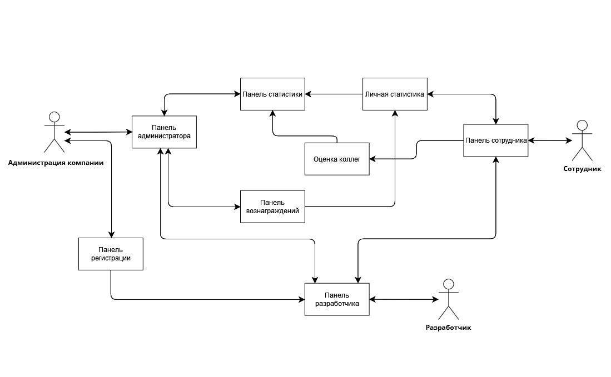

# Встраиваемая система для геймификации процесса взаимодействия между сотрудниками
## Содержание
  * [Описание доменной области](https://github.com/Bopobywek/Soiree#описание-доменной-области)
  * [Use-Cases](https://github.com/Bopobywek/Soiree#use-cases)
  * [Описание (не-)функциональных требований](https://github.com/Bopobywek/Soiree#%D0%BE%D0%BF%D0%B8%D1%81%D0%B0%D0%BD%D0%B8%D0%B5-%D0%BD%D0%B5-%D1%84%D1%83%D0%BD%D0%BA%D1%86%D0%B8%D0%BE%D0%BD%D0%B0%D0%BB%D1%8C%D0%BD%D1%8B%D1%85-%D1%82%D1%80%D0%B5%D0%B1%D0%BE%D0%B2%D0%B0%D0%BD%D0%B8%D0%B9)
  * [Компонентная модель](https://github.com/Bopobywek/Soiree#компонентная-модель)

## Описание доменной области

#### A. Вступление
В конкретном фрагмента документа описывается собранная информация о процессах взаимодействия сотрудников компаний малого и среднего бизнеса в течение рабочего дня. Эта информация должна использоваться в качестве справочной при разработке системы для геймификации процесса взаимодейтсвия сотрудников компании между собой.  
#### B. Терминология
#### C. Основная информация о доменной области
* Одной из частых причин разногласий между сотрудниками является конфорнтация взглядов и установок, причём далеко не каждый знает, как правильно сообщить коллеге о затруднениях/актуальных рабочих моментах. [*Источник*](https://vc.ru/hr/121175-kak-izbezhat-konflikta-na-rabote-pravilno-obshchaytes)
* Среди 182 опрошенных старших мендежеров 62% уверены, что с помощью совещаний не удается сплотить команду. [*Источник*](https://www.rbc.ru/own_business/17/01/2018/5a5c76e19a79472b3d4128b0)
* Среди 6,5 тыс. опрошенных россиян более половины респондентов не предпринимают никакие действия по разрешению конфликта на работе, потому что боятся, что попытка разрешения конфликта сделает ситуацию хуже. [*Источник*](https://tass.ru/obschestvo/9890819)
* Люди реже выражают благадарность на работе. [*Источник*](https://vc.ru/hr/175515-12-prostyh-sposobov-uluchshit-komandnuyu-rabotu-na-rabochem-meste)
* Команды, которые ежедневно фокусируются на сильных сторонах, имеют на 12,5% более высокую производительность. [*Источник*](https://vc.ru/hr/175515-12-prostyh-sposobov-uluchshit-komandnuyu-rabotu-na-rabochem-meste)
#### D. Клиенты и пользователи
Потенциальные клиенты — компании малого и среднего бизнеса, в коллективах которых сложились сложные взаимоотношения между сотрудниками, а также молодые компании, которые не хотят допускать трудностей и разногласий между персоналом.

Пользователи — сотрудники и руководство компании.
#### E. Оборудование (окружение)
Руководство компаний, как правило, имеет доступ к компьютеру и к сети Интернет.

Также подавляющее большинство сотрудников имеет телефон с операционной системой Android или iOS, так как уже в текущий момент коммуникация между персоналом происходит посредством мессенджеров.
#### F. Задачи, решение которых уже существует
#### G. Аналоги
Существуют компании, которые занимаются геймификацией процессов в бизнесе персонально для каждого клиента. Однако стоимость за их услгуи достаточно большая особенно для компаний малого бизнеса. Также есть встраиваемые системы, реализующиеся посредством ежемесячной подписки, но в этом случае эти платформы пытаются решить сразу несколько проблем, а не сосредотачиваются на одной.
#### H. Сходства с другими областями

## Use-Cases
### Терминология
> Близкие коллеги

> Секретный комментарий

> Публичный комментарий

### Кейсы
1. Добавление сотрудника администрацией компанией
    * Администратор дает запрос системе на создание аккаунта для нового сотрудника
    * Система генерирует пару login - password для первоначального входа
    * После входа система добавляет сотрудника в общую базу личного рейтинга
2. Оценка коллеги
   * Сотрудник выбирает категорию оценки: "Обязательная оценка "близких" коллег", "Совместный проект", "Просьба о помощи", "Неформальная беседа", "Некорректное поведение" и т.д.
   * Сотрудник выставляет оценку 
   * Сотрудник добавляет секретный/публичный комментарий
   * Сотрудник подтверждает введенные данные нажатием на кнопку
   * Система анализирует данные, полученнные от сотрудника
   * Система сохраняет полученные данные
3. Просмотр интерфейса личной статистики
   * Сотрудник открывает раздел с личной статистикой
   * Сотрудник выбирает критерий оценивания
   * Система получает информацию из базы данных
   * Система формирует статистику
   * Система предоставляет сотруднику статистику
4. Просмотр рейтинга администраций компании:
   * Администрация компании подключается к системе
   * Администрация компании указывает фильтры для получения статистики
   * Система собирает информацию из базы данных
   * Система формирует статистику
   * Система предоставляет статистику администрации компании
5. Запуск системы поощрения отзычивых/активных сотрудников:
   * Система выбирает приз
   * Система выбирает категорию
   * Система выбирает победителя

## Описание (не-)функциональных требований
#### Функциональные требования
  * Система должна обеспечивать исполнение use cases
  * База данных должна обеспечивать доступ к данным о оценках только согласно правам указанным в диаграмме компонентов
#### Нефункциональные требования 
  * Интерфейс сотрудника должен быть интуитивно понятным, чтобы пользование системой не отнимало много времени и сил сотрудника
  * Система в случае ошибки должна не удалять базу данных. Время восставление системы не должно превышать 3 минут
  * Время отклика системы (вне случаев ошибки) не должно превышать 5 секунд
  * Система должна быть расширяема до 5000 сотрудников, но в рамках свойств лицензией, купленной компанией-заказчиком
  * Система и ее составляющие (база данных, интерфейс администратора, интерфейс сотрудника) должны быть способны отправлять отчеты о ошибках компании разработчику

## Компонентная модель

