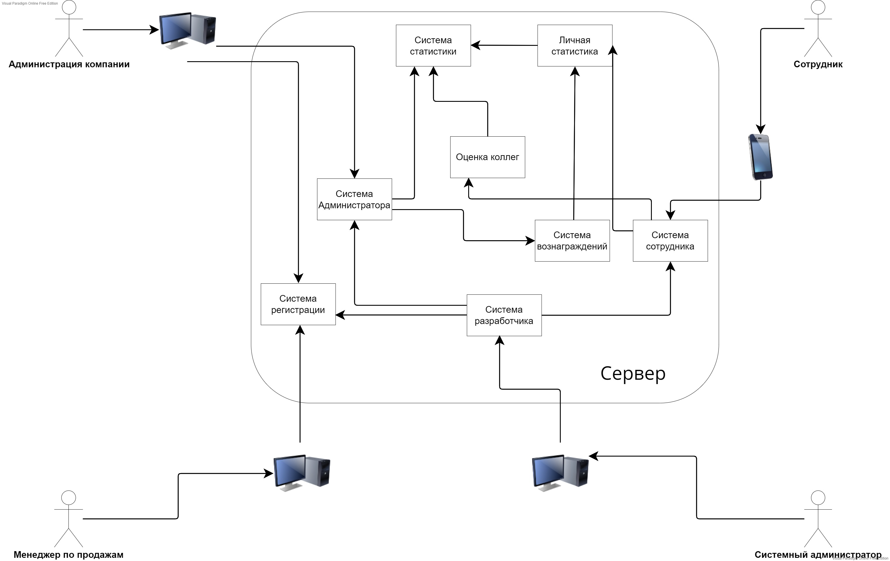

# Встраиваемая система для геймификации процесса взаимодействия между сотрудниками
## Содержание
  * [Описание доменной области](https://github.com/Bopobywek/Soiree#описание-доменной-области)
  * [Use-Cases](https://github.com/Bopobywek/Soiree#use-cases)
    * [Подключение компании к платформе](https://github.com/Bopobywek/Soiree/#%D0%BF%D0%BE%D0%B4%D0%BA%D0%BB%D1%8E%D1%87%D0%B5%D0%BD%D0%B8%D0%B5-%D0%BA%D0%BE%D0%BC%D0%BF%D0%B0%D0%BD%D0%B8%D0%B8-%D0%BA-%D0%BF%D0%BB%D0%B0%D1%82%D1%84%D0%BE%D1%80%D0%BC%D0%B5)
    * [Авторизация в системе](https://github.com/Bopobywek/Soiree/#%D0%B0%D0%B2%D1%82%D0%BE%D1%80%D0%B8%D0%B7%D0%B0%D1%86%D0%B8%D1%8F-%D0%B2-%D1%81%D0%B8%D1%81%D1%82%D0%B5%D0%BC%D0%B5)
    * [Регистрация в системе](https://github.com/Bopobywek/Soiree/#%D1%80%D0%B5%D0%B3%D0%B8%D1%81%D1%82%D1%80%D0%B0%D1%86%D0%B8%D1%8F-%D0%B2-%D1%81%D0%B8%D1%81%D1%82%D0%B5%D0%BC%D0%B5)
    * [Оценивание коллеги](https://github.com/Bopobywek/Soiree/#%D0%BE%D1%86%D0%B5%D0%BD%D0%B8%D0%B2%D0%B0%D0%BD%D0%B8%D0%B5-%D0%BA%D0%BE%D0%BB%D0%BB%D0%B5%D0%B3%D0%B8)
    * [Просмотр общей статистики руководителем](https://github.com/Bopobywek/Soiree/#%D0%BF%D1%80%D0%BE%D1%81%D0%BC%D0%BE%D1%82%D1%80-%D0%BE%D0%B1%D1%89%D0%B5%D0%B9-%D1%81%D1%82%D0%B0%D1%82%D0%B8%D1%81%D1%82%D0%B8%D0%BA%D0%B8-%D1%80%D1%83%D0%BA%D0%BE%D0%B2%D0%BE%D0%B4%D0%B8%D1%82%D0%B5%D0%BB%D0%B5%D0%BC)
    * [Просмотр личной статистики сотрудником](https://github.com/Bopobywek/Soiree/#%D0%BF%D1%80%D0%BE%D1%81%D0%BC%D0%BE%D1%82%D1%80-%D0%BB%D0%B8%D1%87%D0%BD%D0%BE%D0%B9-%D1%81%D1%82%D0%B0%D1%82%D0%B8%D1%81%D1%82%D0%B8%D0%BA%D0%B8-%D1%81%D0%BE%D1%82%D1%80%D1%83%D0%B4%D0%BD%D0%B8%D0%BA%D0%BE%D0%BC)
    * [Просмотр полученных вознаграждений](https://github.com/Bopobywek/Soiree/#%D0%BF%D1%80%D0%BE%D1%81%D0%BC%D0%BE%D1%82%D1%80-%D0%BF%D0%BE%D0%BB%D1%83%D1%87%D0%B5%D0%BD%D0%BD%D1%8B%D1%85-%D0%B2%D0%BE%D0%B7%D0%BD%D0%B0%D0%B3%D1%80%D0%B0%D0%B6%D0%B4%D0%B5%D0%BD%D0%B8%D0%B9)
    * [Назначение вознаграждений сотруднику](https://github.com/Bopobywek/Soiree/#%D0%BD%D0%B0%D0%B7%D0%BD%D0%B0%D1%87%D0%B5%D0%BD%D0%B8%D0%B5-%D0%B2%D0%BE%D0%B7%D0%BD%D0%B0%D0%B3%D1%80%D0%B0%D0%B6%D0%B4%D0%B5%D0%BD%D0%B8%D0%B9-%D1%81%D0%BE%D1%82%D1%80%D1%83%D0%B4%D0%BD%D0%B8%D0%BA%D1%83)
  * [Описание (не-)функциональных требований](https://github.com/Bopobywek/Soiree#%D0%BE%D0%BF%D0%B8%D1%81%D0%B0%D0%BD%D0%B8%D0%B5-%D0%BD%D0%B5-%D1%84%D1%83%D0%BD%D0%BA%D1%86%D0%B8%D0%BE%D0%BD%D0%B0%D0%BB%D1%8C%D0%BD%D1%8B%D1%85-%D1%82%D1%80%D0%B5%D0%B1%D0%BE%D0%B2%D0%B0%D0%BD%D0%B8%D0%B9)
  * [Компонентная модель](https://github.com/Bopobywek/Soiree#компонентная-модель)
  * [Референсные архитектуры](https://github.com/Bopobywek/Soiree#референсные-архитектуры)

## Описание доменной области

### Термины
> Платформа — мобильное и веб-приложение, представляющие собой реализацию описываемого здесь проекта.   
> Компания-заказчик — компания малого/среднего бизнеса, нуждающаяся в укреплении отношений между сотрудниками.  
> Оценка — балл, оценивающий качества сотрудника.  
> “Близкий” коллега — коллега, с которым сотрудник коммуницирует по рабочим вопросам.  
> Вознаграждение — некий приз (возможно денежная премия), назначаемый руководством,  за корректное и доброжелательное отношение к коллегам.  
> Статистика (отчёт) — данные за некоторый промежуток времени.   

### О проекте

## Use-Cases
### Подключение компании к платформе
-----
**Название:** Подключение компании к платформе 
**Действующие лица:** руководитель компании (заказчик), менеджер по продажам, системный администратор  
**Предусловия:** руководитель имеет стабильное интернет-соединение. У руководителя на устройстве открыт лендинг проекта  
**Триггер:** Руководитель решает подключить компанию к платформе 
**Результат:** Компания подключена к платформе. Сотрудники и руководитель могут использовать платформу 

**Успешный сценарий:**
<pre>
1. Руководитель компании заполняет форму на лендинге проекта.
2. Руководитель нажимает на кнопку для отправки заявки.
3. Система валидирует заполненную форму.
4. Система не находит ошибок. (4А)
5. Система информирует руководителя об успешном заполнении формы.
6. Система сохраняет заполненную форму.
7. Система уведомляет менеджера по продажам о новой заявке.
8. Менеджер получает уведомление.
9. Менеджер связывается с заказчиком.
10. Менеджер уточняет детали подключения.
11. Менеджер согласовывает стоимость подключения компании к системе. (11А, 11И)
12. Менеджер выставляет счёт для оплаты и подготавливает необходимый пакет документов.
13. Заказчик оплачивает подключение.
14. Системный администратор получает уведомление о новой заявке на подключение.
15. Системный администратор получает от менеджера данные о компании.
16. Системный администратор обращается к панели администратора системы.
17. Система предоставляет системному администратору доступ к панели администратора после авторизации.
18. Системный администратор создаёт в системе новую компанию.
19. Системный администратор вносит в систему данные о компании.
20. Системный администратор запрашивает у системы генерацию пары “логин-пароль”
    для входа в систему сотрудников и руководителя.
21. Система по введенным данным генерирует пару “логин-пароль” для входа в систему.
22. Система рассылает на введенные адреса электронных корпоративных почт сгенерированные пары.
</pre> 

**Альтернативный сценарий 4A:**  
**Название:** Система при валидации нашла ошибки
<pre>
4a1. Система выводит сообщение об ошибке.
Далее сценарий возвращается к п. 1.
</pre> 

**Альтернативный сценарий 11A:**  
**Название:** Менеджеру не удалось согласовать с заказчиком стоимость подключения
<pre>
11а1. Менеджер предлагает заказчику специальное предложение по оплате подключения.
11а2. Заказчик соглашается.
Далее сценарий идет с п. 12
</pre> 

**Исключительный сценарий 11И:** 
**Название:** Заказчик отказывается от подключения
<pre>
11и1. Заказчик отказывается от подключения к системе и завершает звонок.
11и2. Менеджер удаляет заявку из системы.
Сценарий завершен.
</pre> 

**Альтернативный сценарий:**  
**Название:** Потеря интернет-соединения
<pre>
1. Система выводит сообщение об ошибке.
2. Система пробует повторно отправить запрос.
3. Если интернет-соединение было восстановлено и запрос получилось отправить,
   то сценарий переходит к шагу 4. Иначе сценарий возвращается на шаг 1,
   пока количество попыток отправки 4. запроса не превысит 10.
5. Системе удалось отправить запрос.
6. Система выводит информационное сообщение.
Далее сценарий переходит к п. 1. успешного сценария.
</pre> 

**Исключительный сценарий:**  
**Название:** Потеря интернет-соединения
<pre>
1. Система выводит сообщение об ошибке.
2. Система пробует повторно отправить запрос.
3. Если интернет-соединение было восстановлено и запрос получилось отправить,
   то сценарий переходит к шагу 4. Иначе сценарий возвращается на шаг 1,
   пока количество попыток отправки 4. запроса не превысит 10.
5. Системе не удалось отправить запрос.
6. Система выводит сообщение об ошибке и прекращает попытки связаться с сервером.
Сценарий завершен.
</pre> 

### Авторизация в системе
-----
**Название:** Авторизация в системе 
**Действующие лица:** пользователь системы 
**Предусловия:** пользователь имеет стабильное интернет-соединение 
**Триггер:** пользователю требуется авторизоваться в системе 
**Результат:** пользователь авторизован в системе 

**Успешный сценарий:**
<pre>
1. Система отображает меню авторизации. (1A)
2. Пользователь вводит логин и пароль для доступа к системе.
3. Пользователь нажимает на кнопку авторизации
4. Cистема валидирует форму с логином и паролем.
5. Система не находит ошибки. (5A)
6. Система информирует пользователя об успешной попытке авторизации. (6A)
7. Система переводит пользователя на главную страницу
</pre> 

**Альтернативный сценарий 1А:** 
**Название:** Пользователь уже авторизован
<pre>
Сценарий переходит к п. 7. успешного сценария.
</pre> 

**Альтернативный сценарий 5A:** 
**Название:** Введенные данные не соответствуют формату
<pre>
5а1. Система выводит сообщение об ошибке.
Далее сценарий переходит к п. 1. успешного сценария.
</pre> 

**Альтернативный сценарий 6А:**  
**Название:** Неудачная попытка авторизации
<pre>
6а1. Система информирует пользователя об ошибке авторизации, а также сообщает причину неудачной попытки.
Далее сценарий переходит к п. 1. успешного сценария.
</pre> 

### Регистрация в системе
-----
**Название:** Регистрация в системе  
**Действующие лица:** пользователь системы, администратор системы 
**Предусловия:** пользователь имеет стабильное интернет-соединение 
**Триггер:** пользователю требуется зарегистрироваться в системе 
**Результат:** пользователь зарегистрирован в системе 

**Успешный сценарий:**
<pre>
1. Пользователь обращается к системному администратору.
2. Системный администратор запрашивает у системы генерацию новой учетной записи.
3. Система открывает диалоговое окно для ввода логина и адрес электронной почты новой учетной записи.
4. Системный администратор вводит логин и адрес электронной почты.
5. Система генерирует пароль для новой учетной записи.
6. Система высылает на указанный адрес электронной почты письмо с данными от учётной записи.
</pre> 

**Альтернативный сценарий 5A:** 
**Название:** Пользователь с данным логином уже зарегистрирован
<pre>
5а1. Система выводит сообщение об ошибке.
Далее сценарий переходит к п. 3. успешного сценария.
</pre> 

### Оценивание коллеги
-----
**Название:** Оценивание коллеги  
**Действующие лица:** сотрудник компании  
**Предусловия:** на мобильном устройстве сотрудника установлено
                 необходимое приложение для работы с системой,
                 сотрудник имеет стабильное интернет-соединение,
                 компания сотрудника подключена к системе  
**Триггер:** сотрудник хочет оценить коллегу  
**Результат:** сотрудник успешно выставил оценку коллеге, а также оставил комментарий  

**Успешный сценарий:**
<pre>
1. Сотрудник выбирает в меню пункт оценивания коллег.
2. Система отображает меню выбора коллеги для выставления оценки и написания отзыва.
3. Сотрудник выбирает коллегу.
4. Система отображает категории оценивания, а также текстовое поле для комментария.
5. Сотрудник выставляет в каждой из категорий оценку и при желании оставляет комментарий.
6. Сотрудник нажимает на кнопку для отправки оценивания.
7. Система сохраняет оценку пользователя. (7И)
</pre>  

**Исключительный сценарий 7И:** 
**Название:** Системе не удалось сохранить оценку пользователя
<pre>
7и1. Система выводит сообщение об ошибке пользователю.
7и2. Сисетма отправляет сообщение об ошибке разработчику.
7и3. Система отображает главное меню.
Сценарий завершен.
</pre> 

**Альтернативный сценарий:**  
**Название:** Потеря интернет-соединения
<pre>
1. Система выводит сообщение об ошибке.
2. Система пробует повторно отправить запрос.
3. Если интернет-соединение было восстановлено и запрос получилось отправить,
   то сценарий переходит к шагу 4. Иначе сценарий возвращается на шаг 1,
   пока количество попыток отправки 4. запроса не превысит 10.
5. Системе удалось отправить запрос.
6. Система выводит информационное сообщение.
Далее сценарий переходит к п. 1. успешного сценария.
</pre> 

**Исключительный сценарий:**  
**Название:** Потеря интернет-соединения
<pre>
1. Система выводит сообщение об ошибке.
2. Система пробует повторно отправить запрос.
3. Если интернет-соединение было восстановлено и запрос получилось отправить,
   то сценарий переходит к шагу 4. Иначе сценарий возвращается на шаг 1,
   пока количество попыток отправки 4. запроса не превысит 10.
5. Системе не удалось отправить запрос.
6. Система выводит сообщение об ошибке и прекращает попытки связаться с сервером.
Сценарий завершен.
</pre> 

### Просмотр общей статистики руководителем
-----
**Название:** Просмотр общей статистики руководителем 
**Действующие лица:** руководитель компании 
**Предусловия:** руководитель имеет стабильное интернет-соединение 
**Триггер:** руководитель компании хочет получить отчёт о взаимодействии сотрудников 
**Результат:** руководитель получает отчёт о взаимодействии сотрудников компании за выбранный период 

**Успешный сценарий:**
<pre>
1. Руководитель выбирает в меню пункт просмотра статистики.
2. Система отображает раздел просмотра статистики и предоставляет возможность настроить фильтры отображения.
3. Руководитель устанавливает фильтры.
4. Руководитель запрашивает статистику нажатием на кнопку.
5. Система в соответствии с установленными фильтрами формирует отчёт.
6. Система отображает отчет.
</pre> 

**Альтернативный сценарий:**  
**Название:** Потеря интернет-соединения
<pre>
1. Система выводит сообщение об ошибке.
2. Система пробует повторно отправить запрос.
3. Если интернет-соединение было восстановлено и запрос получилось отправить,
   то сценарий переходит к шагу 4. Иначе сценарий возвращается на шаг 1,
   пока количество попыток отправки 4. запроса не превысит 10.
5. Системе удалось отправить запрос.
6. Система выводит информационное сообщение.
Далее сценарий переходит к п. 1. успешного сценария.
</pre> 

**Исключительный сценарий:**  
**Название:** Потеря интернет-соединения
<pre>
1. Система выводит сообщение об ошибке.
2. Система пробует повторно отправить запрос.
3. Если интернет-соединение было восстановлено и запрос получилось отправить,
   то сценарий переходит к шагу 4. Иначе сценарий возвращается на шаг 1,
   пока количество попыток отправки 4. запроса не превысит 10.
5. Системе не удалось отправить запрос.
6. Система выводит сообщение об ошибке и прекращает попытки связаться с сервером.
Сценарий завершен.
</pre> 

### Просмотр личной статистики сотрудником
-----
**Название:** Просмотр личной статистики сотрудником 
**Действующие лица:** сотрудник компании 
**Предусловия:** на мобильном устройстве сотрудника установлено необходимое приложение для работы с системой, сотрудник имеет стабильное интернет-соединение, компания сотрудника подключена к системе 
**Триггер:** сотрудник хочет посмотреть свои “оценки” и другую статистику 
**Результат:** сотрудник получает отчёт 

**Успешный сценарий:**
<pre>
1. Сотрудник выбирает в меню пункт просмотра личной статистики.
2. Система отображает раздел просмотра личной статистики и предоставляет возможность настроить фильтры.
3. Сотрудник устанавливает фильтры.
4. Сотрудник нажатием на кнопку запрашивает статистику.
5. Система в соответствии с заданными фильтрами формирует отчёт.
6. Система предоставляет отчет сотруднику.
</pre> 

**Альтернативный сценарий:**  
**Название:** Потеря интернет-соединения
<pre>
1. Система выводит сообщение об ошибке.
2. Система пробует повторно отправить запрос.
3. Если интернет-соединение было восстановлено и запрос получилось отправить,
   то сценарий переходит к шагу 4. Иначе сценарий возвращается на шаг 1,
   пока количество попыток отправки 4. запроса не превысит 10.
5. Системе удалось отправить запрос.
6. Система выводит информационное сообщение.
Далее сценарий переходит к п. 1. успешного сценария.
</pre> 

**Исключительный сценарий:**  
**Название:** Потеря интернет-соединения
<pre>
1. Система выводит сообщение об ошибке.
2. Система пробует повторно отправить запрос.
3. Если интернет-соединение было восстановлено и запрос получилось отправить,
   то сценарий переходит к шагу 4. Иначе сценарий возвращается на шаг 1,
   пока количество попыток отправки 4. запроса не превысит 10.
5. Системе не удалось отправить запрос.
6. Система выводит сообщение об ошибке и прекращает попытки связаться с сервером.
Сценарий завершен.
</pre> 

### Просмотр полученных вознаграждений
-----
**Название:** Просмотр полученных вознаграждений 
**Действующие лица:** сотрудник компании 
**Предусловия:** на мобильном устройстве сотрудника установлено необходимое приложение для работы с системой, сотрудник имеет стабильное интернет-соединение, компания сотрудника подключена к системе 
**Триггер:** сотрудник хочет получить отчёт о назначенных когда-либо вознаграждениях 
**Результат:** сотрудник получает отчёт о назначенных ему когда-либо вознаграждениях 

**Успешный сценарий:**
<pre>
1. Сотрудник выбирает в меню пункт просмотра полученных вознаграждений.
2. Система отображает раздел просмотра полученных вознаграждений
   и позволяет указать период, за который можно посмотреть назначенные вознаграждения.
3. Сотрудник при необходимости указывает период.
4. Сотрудник нажатием на кнопку запрашивает отчет.
5. Система в соответствии с заданным периодом формирует отчёт.
6. Система предоставляет отчет сотруднику.
</pre> 

**Альтернативный сценарий:**  
**Название:** Потеря интернет-соединения
<pre>
1. Система выводит сообщение об ошибке.
2. Система пробует повторно отправить запрос.
3. Если интернет-соединение было восстановлено и запрос получилось отправить,
   то сценарий переходит к шагу 4. Иначе сценарий возвращается на шаг 1,
   пока количество попыток отправки 4. запроса не превысит 10.
5. Системе удалось отправить запрос.
6. Система выводит информационное сообщение.
Далее сценарий переходит к п. 1. успешного сценария.
</pre> 

**Исключительный сценарий:**  
**Название:** Потеря интернет-соединения
<pre>
1. Система выводит сообщение об ошибке.
2. Система пробует повторно отправить запрос.
3. Если интернет-соединение было восстановлено и запрос получилось отправить,
   то сценарий переходит к шагу 4. Иначе сценарий возвращается на шаг 1,
   пока количество попыток отправки 4. запроса не превысит 10.
5. Системе не удалось отправить запрос.
6. Система выводит сообщение об ошибке и прекращает попытки связаться с сервером.
Сценарий завершен.
</pre> 

### Назначение вознаграждений сотруднику
-----
**Название:** Назначение вознаграждений сотруднику 
**Действующие лица:** руководитель компании 
**Предусловия:** руководитель имеет стабильное интернет-соединение 
**Триггер:** руководитель хочет назначить сотруднику вознаграждение 
**Результат:** руководитель назначает сотруднику вознаграждение, сотрудник получает уведомление 

**Успешный сценарий:**
<pre>
1. Руководитель в меню выбирает пункт “назначить вознаграждение”.
2. Система отображает раздел назначения вознаграждения.
3. Руководитель выбирает сотрудника, которого он хочет вознаградить.
4. Руководитель создаёт вознаграждение.
5. Система выводит диалоговое окно для создания нового вознаграждения.
6. Руководитель вводит основную информацию о вознаграждении.
7. Руководитель подтверждает введенную информацию нажатием на кнопку.
8. Система отображает созданное вознаграждение 
   и автоматически выбирает его в качестве вознаграждения сотруднику.
9. Руководитель нажимает на кнопку для назначения сотруднику вознаграждения.
10. Система сохраняет информацию о вознаграждении.
11. Система уведомляет сотрудника, которому было назначено вознаграждение.
</pre>

**Альтернативный сценарий:**  
**Название:** Потеря интернет-соединения
<pre>
1. Система выводит сообщение об ошибке.
2. Система пробует повторно отправить запрос.
3. Если интернет-соединение было восстановлено и запрос получилось отправить,
   то сценарий переходит к шагу 4. Иначе сценарий возвращается на шаг 1,
   пока количество попыток отправки 4. запроса не превысит 10.
5. Системе удалось отправить запрос.
6. Система выводит информационное сообщение.
Далее сценарий переходит к п. 1. успешного сценария.
</pre> 

**Исключительный сценарий:**  
**Название:** Потеря интернет-соединения
<pre>
1. Система выводит сообщение об ошибке.
2. Система пробует повторно отправить запрос.
3. Если интернет-соединение было восстановлено и запрос получилось отправить,
   то сценарий переходит к шагу 4. Иначе сценарий возвращается на шаг 1,
   пока количество попыток отправки 4. запроса не превысит 10.
5. Системе не удалось отправить запрос.
6. Система выводит сообщение об ошибке и прекращает попытки связаться с сервером.
Сценарий завершен.
</pre> 

## Описание (не-)функциональных требований

### Функциональные требования:
1. Система должна предоставлять возможность авторизации.
2. Система должна предоставлять возможность регистрации новой учетной записи системным администратором.
3. Система должна сохранять собранную статистику.
4. В системе должна быть реализовано управление доступом на основе ролей.
5. Система должна предоставлять руководителю компании возможность получить отчёт о взаимодействии сотрудников в веб-приложении.
6. Система должна предоставлять сотруднику компании возможность получить отчёт о личном прогрессе в мобильном приложении.
7. Система должна предоставлять сотруднику компании возможность анонимно оценить своего коллегу в мобильном приложении.
8. Система должна предоставлять руководителю компании возможность назначить вознаграждение сотруднику в веб-приложении.
9. Система должна предоставлять сотруднику компании возможность ознакомиться с назначенными ему вознаграждениями в мобильном приложении.
10. Система должна предоставлять возможность сбора заявок на подключение к платформе через лендинг проекта.
11. Система должна уметь генерировать пароль для новой учетной записи по заданному логину и адресу электронной почты.
12. Мобильное приложение платформы должно уметь уведомлять сотрудника об изменениях и других событиях.
13. Система должна предоставлять возможность удаления неактуальных заявок на подключение платформы.
14. В системе должна быть возможность рассылки уведомлений на электронную почту.

### Нефункциональные требования:
1. Мобильное приложение для работы с платформой должно поддерживать устройства, работающие под операционной системой Android версии 6.0.
2. Время загрузки веб-приложения для работы с системой не должно превышать 7 секунд.
3. Время загрузки мобильного приложения не должно превышать 7 секунд.
4. Интерфейс мобильного приложения и веб-приложения должен соответствовать руководящим принципам дизайн-системы [Material Design](https://material.io/design/guidelines-overview).
5. Веб-приложение должно корректно отображаться в браузерах Mozilla Firefox версии 95.0.2 и Google Chrome версии 97.0.4692
6. Время восстановления системы после сбоя не должно превышать 1 часа.

## Компонентная модель

## Референсные архитектуры

* Монолитная архитектура
    * Причиной выбора является отсутствие большого количества модулей, которое можно было бы выделить в отдельные микросервисы
* Мобильное приложение: **MVVM (Model-View-ViewModel)**
* Веб-приложение: **MVC (Model-View-Controller)**
